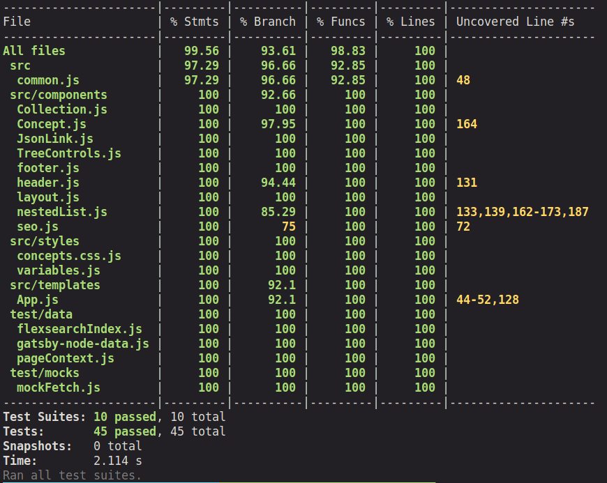
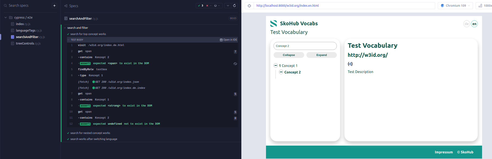

Hello there,

for quite some time SkoHub Vocabs now got new features, like switching languages, display of all relevant properties on the concept page and support for `skos:Collection`.
Unfortunately there were no tests added to actually test these new functionalities.
This led to some surprises now and then, when we noticed that for example the language tags did not show up, when visiting a Collection page directly.

Originally SkoHub Vocabs already contained some tests, so being the maintainer of SkoHub Vocabs I decided to follow up on that and got myself a little bit more familiar on the topic.
Quickly I stumbled over the topic of [Test Driven Development](https://en.wikipedia.org/wiki/Test-driven_development) (TDD) and though I heard of it before, I decided to dive a little deeper and check, if that pattern might be appropriate for SkoHub Vocabs and the other SkoHub modules (and maybe my coding approaches in general).

The general idea of TDD is as follow (borrowed heavily from the Wikipedia article):

- Requirements of a new feature are first translated into test cases
- Tests are written
- Code is written

This leads to the following development cycle:

1. **Write tests**: This ensures that the developer actually understands the user requirements. Usually this is done with the help of use cases and user stories

2. **Run tests**: The tests should now fail. If not, it might be the case that the actual feature is already present in the code and no further code needs to be written. Maybe documentation has to be updated accordingly.

3. **Write the simplest code that passes the new tests**: The code can (and should) later be refactored, so it can be ugly at this point. 

4. **All tests should now pass**: If the code is still failing it should be revised till all tests pass.

5. **Refactor as needed**: Your tests now verify that the new feature is working as expected. If any tests during refactoring fail, you will immediately now and can correct your code.

## Consequences on SkoHub development

This approach has some consequences for the development of SkoHub modules.
These changes will also be reflected in the [yet to be published CONTRIBUTING.md](https://github.com/skohub-io/skohub-vocabs/issues/242).
Issues for new features should contain use cases and user stories as well as some notes that indicate when the feature is actually correctly implemented.
Just when all of this is present, the issue can be marked as ready.
The use cases and notes can then be used to write the tests and follow the above mentioned development cycle.

Regarding code review the approach also some consequences.
Code review should only be approved, if tests were added for the new feature or the tests were adapted in case of bug fixing.

## Testing Strategies and Technologies in SkoHub Vocabs

At the end of this blog post I want to give you a short overview of currently used testing strategies and technologies used in SkoHub Vocabs development.
We use **unit tests**, **integration tests** and **end-to-end tests** whereby we try to write more unit tests than integration tests than end-to-end tests.
The reason for this is that end-to-end tests take long and are quite expensive regarding computing power and time.
Unit and integration tests on the other hand are cheap and can also auto-run in the background on every save.
This gives you immediate feedback if you broke something.

For unit and integration tests we use [Jest](https://jestjs.io/) and the [React-Testing-Library](https://testing-library.com/docs/react-testing-library/intro) since Gatsby uses React.
Some of the older tests used [Enzyme](https://enzymejs.github.io/enzyme/), but after upgrading to React 18 I noticed that Enzyme was no longer working, because [the project is dead](https://dev.to/wojtekmaj/enzyme-is-dead-now-what-ekl).
After some research I found the React-Testing-Library as the most recommended testing framework and migrated the old Enzyme tests.
Following some initial training writing tests became actually quite handy and fun.
Adding tests is by no way finished at this point, but a lot of the lately added feature now have some proper testing and also required a few changes in the code base from now and then when I noticed things weren't working as expected.

For end-to-end tests I decided to go with [cypress](https://www.cypress.io/) since it has an excellent documentation if fully open source and runs tests in a real browser.

All of the tests are actually integrated in the SkoHub Vocabs CI pipeline and run before a new docker image gets build.

