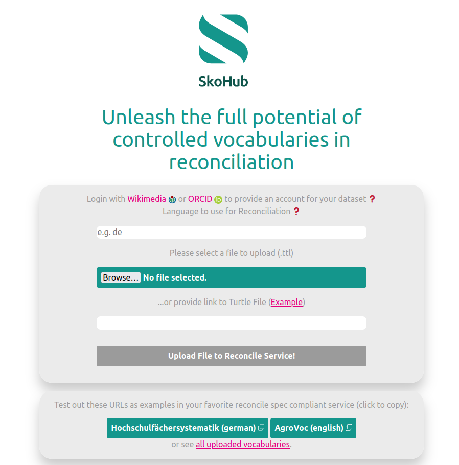
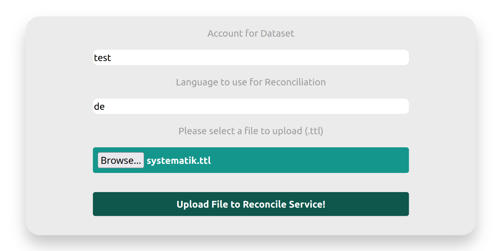
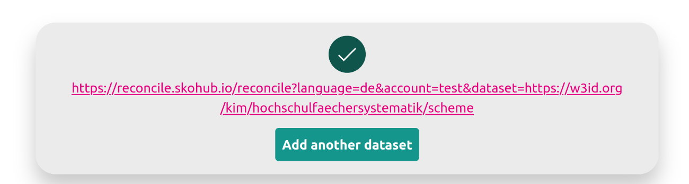
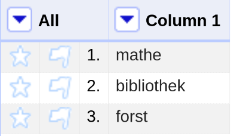
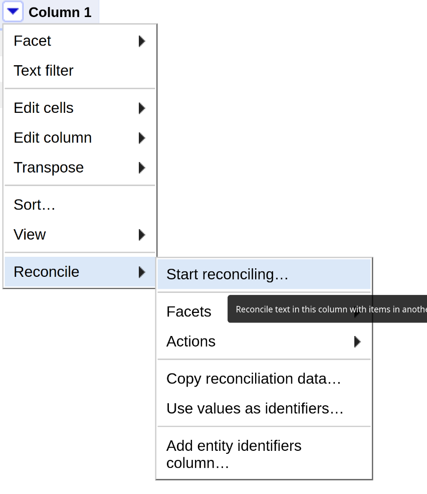
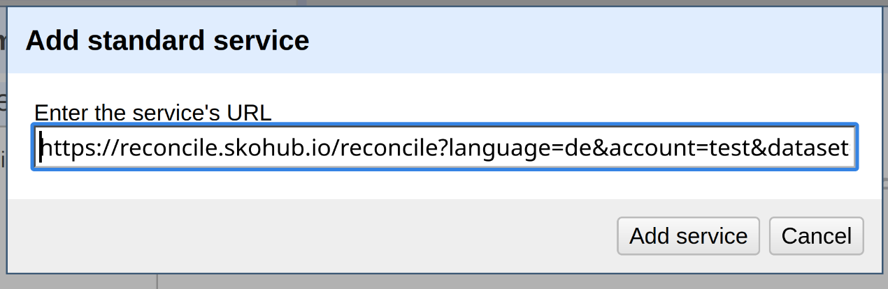
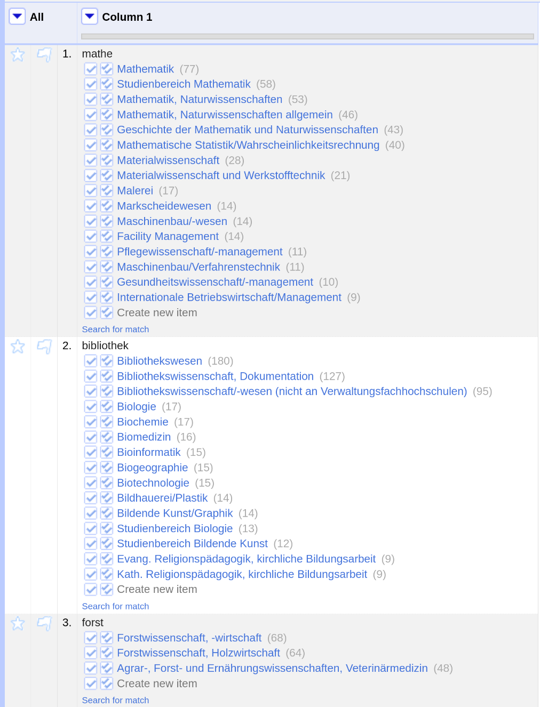
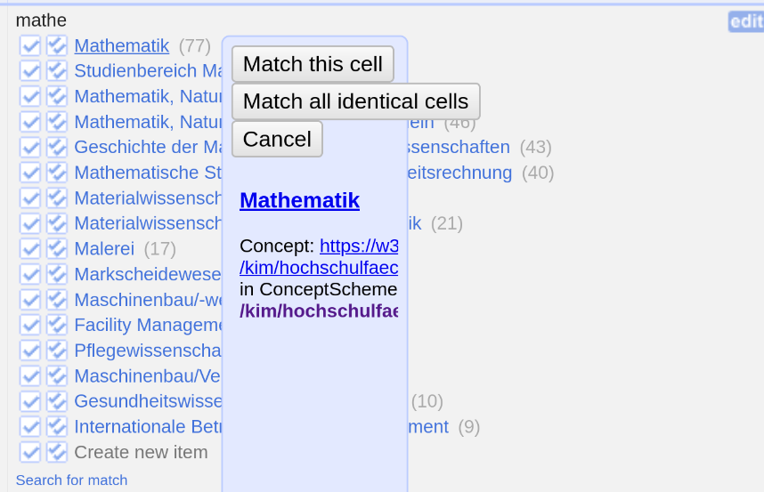
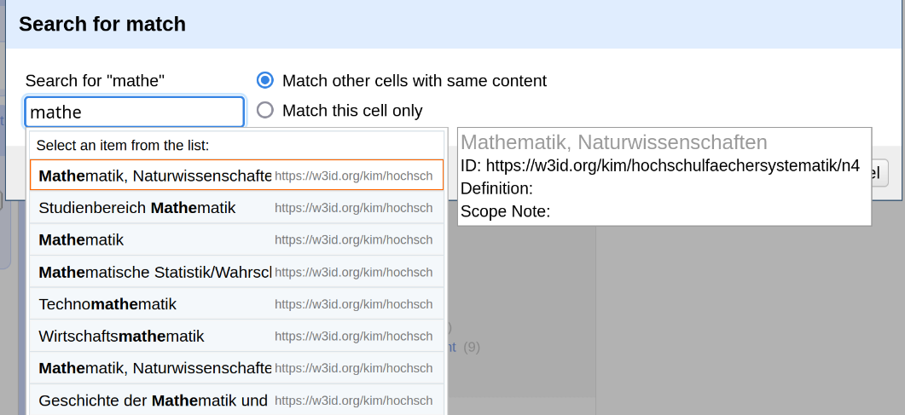
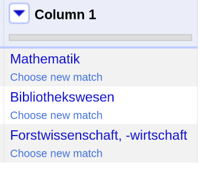

Reconciliation is the process of integrating data from sources which do not share common unique identifiers and matching them with records which refer to the same entities.
This happens mostly by comparing the attributes of the entities.
For instance, two entries in a catalogue about persons that share the same date of birth, place of birth, name and death date, might actually the same person.
Merging these two entries and connecting their identifiers is the process of reconciliation.

To facilitate this process multiple tools exist with [OpenRefine](https://openrefine.org/) being the most prominent tool.
To align and standardize the way of providing data for these tools the [Reconciliation Service API](https://reconciliation-api.github.io/specs/draft/) is drafted.
The specification thereby defines endpoints that services that provide data can expose so that services like OpenRefine can handle that data.
A number of services have already implemented the specification, like [OpenRefine](https://openrefine.org/), [TEI Publisher](https://teipublisher.com/) or [Cocoda](https://coli-conc.gbv.de/cocoda/).

To make SKOS vocabularies usable Andreas Wagner presented built a reconciliation prototype for SKOS vocabularies (see also our [Workshop Blog Post](https://blog.skohub.io/2022-12-19-workshop-summary/).
We picked this prototype up, refactored it and moved it into a container based infrastructure.
We also added support for v0.2 of the spec.

## SkoHub Reconcile Publish

To make it easy to upload vocabularies to the reconciliation service a front-end was set up, to upload your vocabularies.



Every vocabulary that passes the SkoHub Shacl Shape (see our [blog post](https://blog.skohub.io/2023-11-22-shacl-shape/)) should work for uploading to the reconcile service.
The only additional requirement is to provide a `vann:preferredNamespaceUri`.
As you can see in the screenshot you also have to provide an account and a language.
As for the account you can currently choose whatever you want, just make sure it is unique enough, so your dataset (i.e. your vocabulary) does not get overwritten by someone else.
Since a `lang` parameter is only available since the [current draft](https://reconciliation-api.github.io/specs/draft/#service-manifest) version of the reconciliation specification and not yet implemented in SkoHub Reconcile, the current version of the SkoHub Reconcile service requires you to specify a language you want to use for reconciliation.

## Example: Usage in OpenRefine

Let's see how we can use the service with OpenRefine.

First, we upload the vocabulary.
We will use a classification of [subject groups](https://w3id.org/kim/hochschulfaechersystematik/scheme).



After a successful upload, we are presented with a URI that leads to the ["Service Manifest"](https://reconciliation-api.github.io/specs/draft/#service-manifest) of our reconciliation service.



If we follow the URL <https://reconcile.skohub.io/reconcile?language=de&account=test&dataset=https://w3id.org/kim/hochschulfaechersystematik/scheme> we see some data that services will use for asking our reconciliation service for data:

```json
{
    "versions": [
        "0.2",
        "0.3.0-alpha"
    ],
    "name": "SkoHub reconciliation service for account 'test', dataset 'https://w3id.org/kim/hochschulfaechersystematik/scheme'",
    "identifierSpace": "https://w3id.org/kim/hochschulfaechersystematik/",
    "schemaSpace": "http://www.w3.org/2004/02/skos/core#",
    "defaultTypes": [
        {
            "id": "ConceptScheme",
            "name": "ConceptScheme"
        },
        {
            "id": "Concept",
            "name": "Concept"
        }
    ],
    "view": {
        "url": "{{id}}"
    },
    "preview": {
        "url": "https://reconcile.skohub.io/preview?language=de&account=test&dataset=https://w3id.org/kim/hochschulfaechersystematik/scheme&id={{id}}",
        "width": 100,
        "height": 320
    },
    "suggest": {
        "entity": {
            "service_url": "https://reconcile.skohub.io",
            "service_path": "/suggest?language=de&account=test&dataset=https://w3id.org/kim/hochschulfaechersystematik/scheme&service=entity",
            "flyout_service_path": "/suggest/flyout?language=de&account=test&dataset=https://w3id.org/kim/hochschulfaechersystematik/scheme&id=${id}"
        },
        "property": {
            "service_url": "https://reconcile.skohub.io",
            "service_path": "/suggest?language=de&account=test&dataset=https://w3id.org/kim/hochschulfaechersystematik/scheme&service=property",
            "flyout_service_path": "/suggest/flyout?language=de&account=test&dataset=https://w3id.org/kim/hochschulfaechersystematik/scheme&id=${id}"
        },
        "type": {
            "service_url": "https://reconcile.skohub.io",
            "service_path": "/suggest?language=de&account=test&dataset=https://w3id.org/kim/hochschulfaechersystematik/scheme&service=property",
            "flyout_service_path": "/suggest/flyout&language=de&account=test&dataset=https://w3id.org/kim/hochschulfaechersystematik/scheme&id=${id}"
        }
    }
}
```

Now that the reconciliation service is set up with our data, let's see how we can use it in OpenRefine.

For demo purposes we use a small vocabulary of a few discipline names:



By clicking on the dropdown button of the column we want to reconcile, we choose "Reconcile" -> "Start reconciling...".



After clicking "Add standard service", we can enter the url we were provided with from our upload service:



Then we just have to start the reconciliation by clicking "Start reconciling..." and our reconciliation service will be queried with the terms of the column.
We are then presented with the results:



This looks already good!
Now we can choose matches by clicking the checkmark or get additional information by hovering over the proposed entry from the reconcile service.



If we want we can also search through our vocabulary by clicking "Search for match":



After selecting the appropritate matches we have successfully reconciled our data:




## Next steps

The services are currently in an `alpha` phase and ready for testing.
You can test the service under <https://reconcile-publish.skohub.io/>.

Feedback is very much appreciated, either under skohub@hbz-nrw.de or as an [issue](https://github.com/skohub-io/skohub-reconcile/issues).

Our next step will be integrating the above mentioned `lang` parameter to be able to serve all languages of a vocabulary without the need to specify it beforehand.

## Repositories

- [SkoHub Reconcile](https://github.com/skohub-io/skohub-reconcile/)
- [SkoHub Reconcile Publish](https://github.com/skohub-io/skohub-reconcile-publish/)
