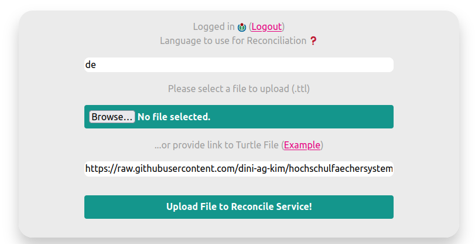
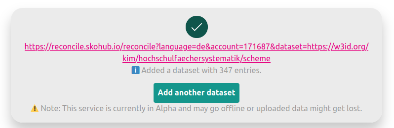

Reconciliation is the process of integrating data from sources which do not share common unique identifiers by identifying records which refer to the same entities.
This happens mostly by comparing the attributes of the entities.
For instance, two entries in a catalogue about persons that share the same date of birth, place of birth, name and death date, will probably be about the same person.
Linking these two entries by adding the identifier from another data source is the process of reconciliation. This allows for extension of your data by taking over information from a linked record.

To facilitate this process multiple tools exist with [OpenRefine](https://openrefine.org/) being the most prominent tool.
To align and standardize the way of providing data for these tools the [Reconciliation Service API](https://reconciliation-api.github.io/specs/draft/) is drafted by the [Entity Reconciliation Community Group](https://www.w3.org/community/reconciliation/) within the World Wide Web Consortium (W3C).
The specification defines endpoints that data services can expose so that applications like OpenRefine can handle that data.
A number of other services have already implemented the specification and can thus be used as clients for reconciliation tasks, e.g. [TEI Publisher](https://teipublisher.com/), [Cocoda](https://coli-conc.gbv.de/cocoda/), or the [Alma Refine plugin](https://developers.exlibrisgroup.com/appcenter/alma-refine/) for the commercial Library Management System Alma.

## Reconciliation and SKOS

[Simple Knowledge Organization System (SKOS)](https://www.w3.org/TR/skos-reference/) is an established standard for modeling controlled vocabularies as Linked Data. Thus, SKOS vocabularies are often targets of reconciliation efforts as you can improve your local data by enriching strings with identifiers of a controlled vocabulary. So SKOS and the Reconciliation Service API often go hand in hand. However, there has not existed an easy way to set up a reconcilation endpoint for an existing SKOS vocabulary. We decided to change that by developing the new SkoHub component [SkoHub-Reconcile](https://github.com/skohub-io/skohub-reconcile).

Andreas Wagner had already built a reconciliation prototype for SKOS vocabularies (see also our [Workshop Blog Post](https://blog.skohub.io/2022-12-19-workshop-summary/)).
We picked this prototype up, refactored it and moved it into a container based infrastructure.
We also added support for [v0.2 of the reconciliation spec](https://www.w3.org/community/reports/reconciliation/CG-FINAL-specs-0.2-20230410/).

## SkoHub Reconcile Publish

To make it easy to upload vocabularies to the reconciliation service a front-end was developed which you can try out at [https://reconcile-publish.skohub.io/](https://reconcile-publish.skohub.io/).


Every vocabulary that passes the SkoHub SHACL Shape (see our [blog post](https://blog.skohub.io/2023-11-22-shacl-shape/)) should work for uploading to the reconcile service.
The only additional requirement is to provide a `vann:preferredNamespaceUri`.
To be able to upload your vocabulary, you need first to sign in using an ORCID or Wikimedia account. This ensures that all your uploaded vocabs are associated with your account and nobody else is able to overwrite the data.
As you can see in the screenshot you also have to provide a language.[^1]

Let's see how we can set up and use a reconciliation endpoint for a vocabulary.

## Uploading a vocabulary

First, we upload the vocabulary.
We will use a classification of [subject groups](https://w3id.org/kim/hochschulfaechersystematik/scheme).



After a successful upload of the [turtle file](https://raw.githubusercontent.com/dini-ag-kim/hochschulfaechersystematik/master/hochschulfaechersystematik.ttl), we are presented with a URI that leads to the ["Service Manifest"](https://reconciliation-api.github.io/specs/draft/#service-manifest) of our reconciliation service.



If we follow the URL <https://reconcile.skohub.io/reconcile?language=de&account=171687&dataset=https://w3id.org/kim/hochschulfaechersystematik/scheme> we see some data that services will use for reconciliation against our vocabulary:

```json
{
   "versions":[
      "0.2",
      "0.3.0-alpha"
   ],
   "name":"SkoHub reconciliation service for account '171687', dataset 'https://w3id.org/kim/hochschulfaechersystematik/scheme'",
   "identifierSpace":"https://w3id.org/kim/hochschulfaechersystematik/",
   "schemaSpace":"http://www.w3.org/2004/02/skos/core#",
   "defaultTypes":[
      {
         "id":"ConceptScheme",
         "name":"ConceptScheme"
      },
      {
         "id":"Concept",
         "name":"Concept"
      }
   ],
   "view":{
      "url":"{{id}}"
   },
   "preview":{
      "url":"https://reconcile.skohub.io/preview?language=de&account=171687&dataset=https://w3id.org/kim/hochschulfaechersystematik/scheme&id={{id}}",
      "width":100,
      "height":320
   },
   "suggest":{
      "entity":{
         "service_url":"https://reconcile.skohub.io",
         "service_path":"/suggest?language=de&account=171687&dataset=https://w3id.org/kim/hochschulfaechersystematik/scheme&service=entity",
         "flyout_service_path":"/suggest/flyout?language=de&account=171687&dataset=https://w3id.org/kim/hochschulfaechersystematik/scheme&id=${id}"
      },
      "property":{
         "service_url":"https://reconcile.skohub.io",
         "service_path":"/suggest?language=de&account=171687&dataset=https://w3id.org/kim/hochschulfaechersystematik/scheme&service=property",
         "flyout_service_path":"/suggest/flyout?language=de&account=171687&dataset=https://w3id.org/kim/hochschulfaechersystematik/scheme&id=${id}"
      },
      "type":{
         "service_url":"https://reconcile.skohub.io",
         "service_path":"/suggest?language=de&account=171687&dataset=https://w3id.org/kim/hochschulfaechersystematik/scheme&service=property",
         "flyout_service_path":"/suggest/flyout&language=de&account=171687&dataset=https://w3id.org/kim/hochschulfaechersystematik/scheme&id=${id}"
      }
   }
}
```

## Example: Usage in OpenRefine

Now that the reconciliation service is set up with our data, let's see how we can use it in OpenRefine.

For demo purposes, we load a small vocabulary of a few discipline names into OpenRefine:


By clicking on the dropdown button of the column we want to reconcile, we choose "Reconcile" -> "Start reconciling...".


After clicking "Add standard service", we can enter the urlprovided by the upload service:


Then we just have to start the reconciliation by clicking "Start reconciling..." and our reconciliation service will be queried with the terms in our OpenRefine project.
We are then presented with the results:


This already looks good!
Now we can choose matches by clicking the checkmark or get additional information by hovering over the proposed entry from the reconcile service.


If we want, we can also search through our vocabulary by clicking "Search for match":


After selecting the appropriate matches we have successfully reconciled our data:


## Further reads

Christel Annemieke Romein, Andreas Wagner and Joris J. van Zundert published a tutorial about [building and deploying a classification schema using open standards and technology](https://doi.org/10.21825/dlh.85751).
In this tutorial they make use of SKOS, SkoHub Vocabs and SkoHub Reconcile.

## Next steps

The services are currently in an `alpha` phase and ready for testing.
You can test the service under <https://reconcile-publish.skohub.io/>.

Feedback is very much appreciated: via email (skohub@hbz-nrw.de), as an [issue](https://github.com/skohub-io/skohub-reconcile/issues) or – primarily for the German-speaking users – in the newly set up discourse forum [metadaten.community](https://metadaten.community/c/software-und-tools/skohub/9).

## Repositories

- [skoHub-reconcile](https://github.com/skohub-io/skohub-reconcile/)
- [skoHub-reconcile-publish](https://github.com/skohub-io/skohub-reconcile-publish/)

\[Edit 2025-03-27: Adjusted some screenshots and text to account for some changes in the UI.\]

[^1]: Since a `lang` parameter has only been available since the [current draft](https://reconciliation-api.github.io/specs/draft/#service-manifest) version of the reconciliation specification and not yet implemented in SkoHub Reconcile, the current version of the SkoHub Reconcile service requires you to specify a language you want to use for reconciliation. We hope to improve this in the future along with the development of the specification.