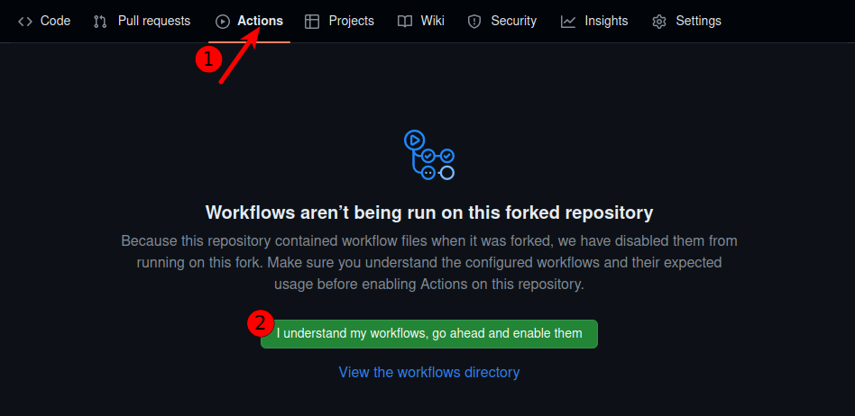
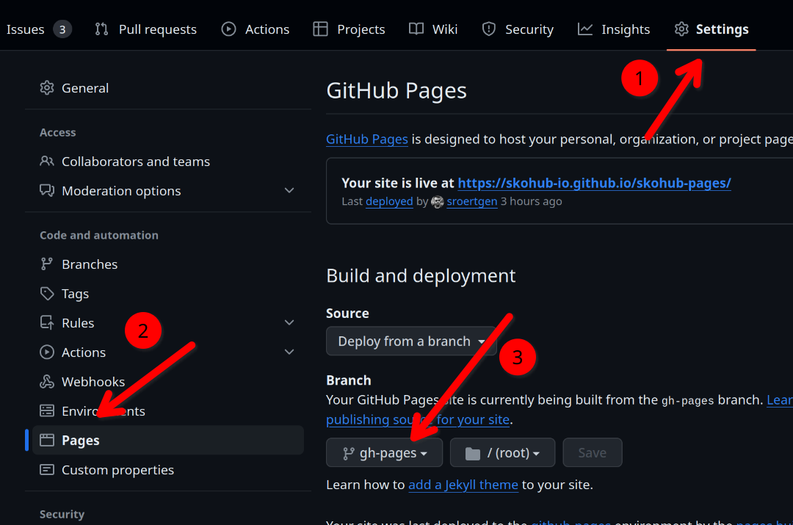
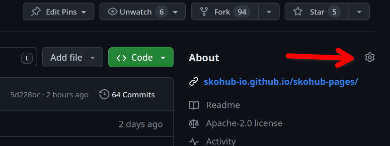
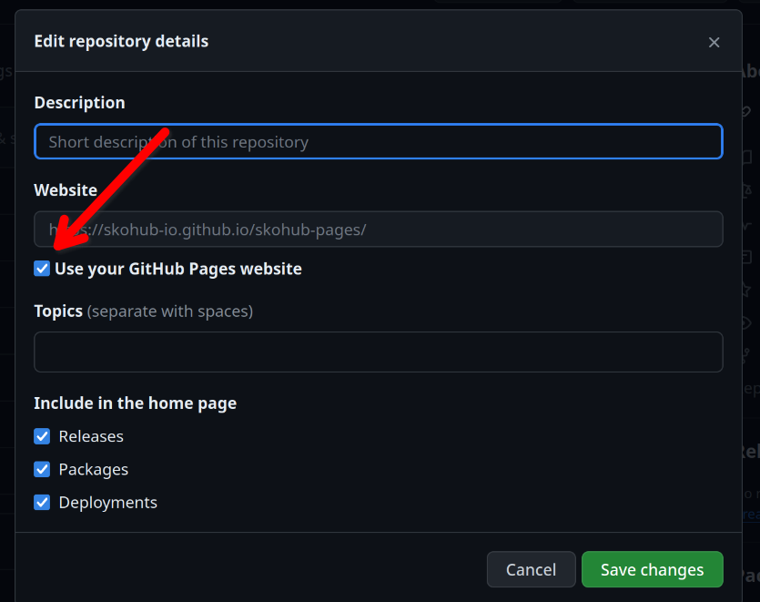

## A simple workflow for publishing your vocabs

With [SkoHub Pages](https://github.com/skohub-io/skohub-pages) we now provide a very simple way for publishing your SKOS vocabulary from a GitHub repository. It only involves 5-6 steps:

**1. Fork the skohub-pages repo**

Click the "Fork" button in the top-right corner of the [SkoHub Pages repo](https://github.com/skohub-io/skohub-pages). You can change the name of your fork to whatever you like, e.g. `my-shiny-vocab`. See also the [GitHub fork documentation](https://docs.github.com/en/pull-requests/collaborating-with-pull-requests/working-with-forks/fork-a-repo#forking-a-repository).


**2. Activate GitHub Actions**



**3. Configure GitHub Pages branch**

Go to "Settings", navigate to the "Pages" setting and select `gh-pages` as the branch your site is being built from.



**4. Update pages URL**

Go back to the main page of your repo and click the little gear icon in the top right of the "About" section. Check the box at "Use your GitHub Pages website".




**5. Start committing**

Now you can add a commit to the main branch adjusting the example vocabularies or adding a new turtle file. The changes will automatically be published to your GitHub pages website that is now linked at the top-right of your GitHub repo (sometimes it takes a little to see the changes, remember to do some hard refreshing).

**6. Set your GitHub Pages URL as namespace (optional)**

See section "Resolving custom domains" below ⬇️


## Utilizing GitHub Actions & Pages

As not all projects or individuals involved in the creation of controlled vocabularies are able or have the resources to run their own infrastructure, we have been pursuing this approach to utilize Docker and GitHub infrastructure for publishing SKOS vocabularies with [SkoHub Vocabs](https://github.com/skohub-io/skohub-vocabs). Specifically, the workflow relies on "[GitHub Pages](https://docs.github.com/de/pages/getting-started-with-github-pages)" and "[GitHub Actions](https://docs.github.com/en/actions)". With GitHub Pages it is possible to host websites on the GitHub infrastructure, GitHub Actions are used for automated tests and deployments.

We have written [a GitHub Action](https://github.com/skohub-io/skohub-pages/blob/main/.github/workflows/main.yml) that ensures that a process is started after each push to the repository which builds the vocabularies with SkoHub Vocabs.
The built vocabulary is then pushed to a separate git branch `gh-pages`.
As seen above, GitHub Pages is configured to deliver HTML pages from this `gh-pages` branch.

We have been using this approach in various introduction to SKOS and SkoHub workshops.
However, in the past the workflow required some adjustments in the GitHub action so that errors could quickly creep in. We are happy to having improved this considerably and made the process much less error-prone! 🎉

The relevant information is now set directly as environment variables and all other customizations can be changed via the GitHub GUI, so the workflow is now much more user-friendly. But that's not all!

## Resolving custom domains

Although with the presented approach the custom vocabulary could be provided without own infrastructure, the domains did not resolve to the GitHub pages.
This means that a concept scheme that uses URIs based on the GitHub Pages domain (e.g. `https://myhandle.github.io/skohub-pages/`) could not be resolved so far. In the past, in order to mitigate this we recommended setting up a redirect via [w3id](https://w3id.org/) or [purl.org](https://purl.archive.org/).
Of course, it still makes sense to set up a redirect (in case the vocabulary moves somewhere else). However, it is now also possible to use the domain that is assigned via GitHub Pages and have quickly set up a fully working SKOS vocabulary with resolving concept URIs which can come handy for prototyping.

To do this, a [`config.yaml`](https://github.com/skohub-io/skohub-pages/blob/main/config.yaml) must be created in the repo.
The respective domain must then be entered under the `custom_domain`.
Example: Your GitHub Pages domain is https://myhandle.github.io/skohub-pages/. Then provide `https://myhandle.github.io/skohub-pages/` as `custom_domain` in your config.yaml.

The base of your concept scheme could then be something like: `https://myhandle.github.io/skohub-pages/myvocab/`

```yaml
#config.yaml
---
# [...]
custom_domain: "https://myhandle.github.io/skohub-pages/"
#[...]
```

```turtle
# colors.ttl
@prefix colour: <https://myhandle.github.io/skohub-pages/myColourVocab/> .
@prefix dct: <http://purl.org/dc/terms/> .
@prefix skos: <http://www.w3.org/2004/02/skos/core#> .
@prefix xsd: <http://www.w3.org/2001/XMLSchema#> .

colour: a skos:ConceptScheme ;
    dct:title "Colour Vocabulary"@en, "Farbvokabular"@de ;
    dct:creator "Hans Dampf"@de ;
    dct:created "2021-11-02"^^xsd:date ;
    dct:license <https://creativecommons.org/publicdomain/zero/1.0/> ;
    skos:hasTopConcept colour:violet, colour:blue .

colour:violet a skos:Concept ;
    skos:prefLabel "Violett"@de, "violet"@en;
    skos:altLabel "Lila"@de, "purple"@en ;
    skos:topConceptOf colour: .

colour:blue a skos:Concept ;
    skos:prefLabel "Blau"@de, "blue"@en ;
    skos:topConceptOf colour: .
```

Feel free to try out our simplified approach and let us know if something does not work: <https://github.com/skohub-io/skohub-pages/issues/new>

## Outlook: Beyond GitHub

There are lots of reasons why people might not want to use the GitHub infrastructure owned by Microsoft for their SKOS publication workflows. That's why we will be looking into replacing as much as possible of this workflow by generic git-based tooling for triggering the build. The goal is to support such an easy SKOS publishing workflow on other forges like GitLab or Forgejo. The work on this happens around this issue: https://github.com/skohub-io/skohub-pages/issues/19

Let us know if you have some good implementation ideas or more wishes for future development!
